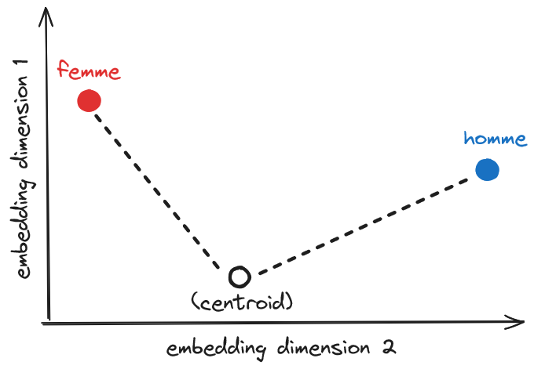

# NLP-gender-project
The objective of this project is to predict the gender of a subject based on its personal data. There are not labels, so it is a problem of unsupervised learning. The data use for testing the model is an extract of the French census from the years 1836 to 1936

##  Model
The first step is to transform the words into vectors by using an embedding. In this case, the embedding 
*fr\_core\_news\_lg* from `spacy' was used. Once all words are embedded, the next step is to perform an average 
of all the vectors in the phrase to obtain a centroid, this is done aiming to later measure the distance 
from the target labels. The figure below shows the different points in the 
embedding space, for which the distance from the target labels "homme" and "femme" needs to be calculated. 
The classification is done by proximity, so if we find that the centroid is closer to ‘homme’ than ‘femme’ 
it will classified as "homme", and viceversa. 

This method was inspired by the job done in https://maxhalford.github.io/blog/unsupervised-text-classification/
